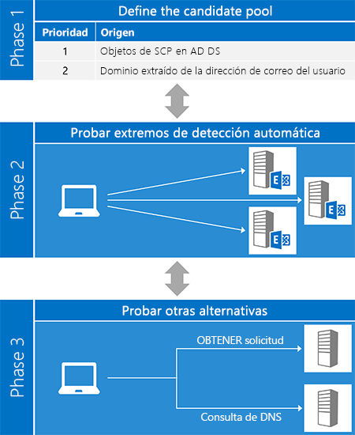
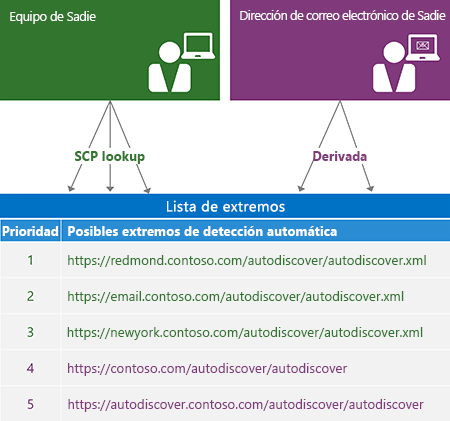
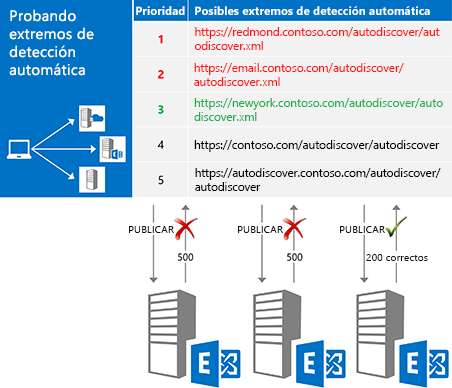

# Detección automática de ExchangeAutodiscover for Exchange

Este documento puede incluir contenido relacionado con funciones o productos preliminares que pueden cambiar mucho antes del lanzamiento comercial final. Este documento se proporciona "tal cual" solamente con fines informativos y Microsoft no realiza ninguna garantía, explícita ni implícita, en el documento. Información sobre el servicio Detección automática de Exchange.Learn about the Autodiscover service in Exchange.
  
El servicio Detección automática de Exchange proporciona una manera sencilla para que la aplicación cliente se configure con una entrada de usuario mínima. La mayoría de los usuarios conocen su dirección de correo electrónico y su contraseña, y con estos dos fragmentos de información, puede recuperar el resto de detalles que necesita para empezar a trabajar. Para los clientes de los servicio Web Exchange (EWS), la Detección automática se usa normalmente para buscar la dirección URL del extremo EWS, pero la Detección automática también puede proporcionar información para configurar los clientes que usan otros protocolos. La Detección automática funciona para las aplicaciones cliente dentro o fuera de los firewall y funcionará en el bosque de recursos y en varios escenarios de bosques.The Exchange Autodiscover service provides an easy way for your client application to configure itself with minimal user input. Most users know their email address and password, and with those two pieces of information, you can retrieve all the other details you need to get up and running. For Exchange Web Services (EWS) clients, Autodiscover is typically used to find the EWS endpoint URL, but Autodiscover can also provide information to configure clients that use other protocols. Autodiscover works for client applications that are inside or outside firewalls and will work in resource forest and multiple forest scenarios.
  
## Información general del proceso Detección automáticaOverview of the Autodiscover process

Básicamente, el proceso Detección automática tiene tres fases. En la primera fase, se genera una lista de servidores de Detección automática posibles y, en la segunda fase, se prueba cada servidor de la lista hasta que se obtiene una respuesta correcta. Si ninguno de los candidatos funciona, pasa a la fase tres, que representa una intento "última zanja" de buscar un extremo de Detección automática.The Autodiscover process essentially has three phases. In phase one, you generate a list of potential Autodiscover servers, and in phase two, you try each server in your list until you (hopefully) get a successful response. If none of your candidates worked out, you move on to phase three, which represents a "last ditch" attempt to find an Autodiscover endpoint.
  
El método [ExchangeService.AutodiscoverUrl](http://msdn.microsoft.com/en-us/library/microsoft.exchange.webservices.data.exchangeservice.autodiscoverurl%28v=exchg.80%29.aspx) de la API administrada EWS implementa las tres fases de este proceso por lo que, si usa la API administrada EWS, no tiene que preocuparse de implementar la Detección automática. La siguiente figura muestra las tres fases del proceso Detección automática.The [ExchangeService.AutodiscoverUrl](http://msdn.microsoft.com/en-us/library/microsoft.exchange.webservices.data.exchangeservice.autodiscoverurl%28v=exchg.80%29.aspx) method in the EWS Managed API implements all three phases of this process for you, so if you are using the EWS Managed API, you don't need to worry about implementing Autodiscover yourself. The following figure shows the three phases of the Autodiscover process. 
  
**Figura 1. Las tres fases del proceso Detección automática****Figure 1. Three phases of the Autodiscover process**

  
### Fase 1: Definir el grupo de candidatosPhase 1: Defining the candidate pool

Antes de poder usar Detección automática, tiene que buscar el servidor Detección automática adecuado para el usuario. Afortunadamente, Detección automática define un número limitado de sitios para consultar. En el caso de que se encuentren varios candidatos, Detección automática también define [un modo de generar y dar prioridad a la lista](how-to-generate-a-list-of-autodiscover-endpoints.md).Before you can use Autodiscover, you have to locate the right Autodiscover server for your user. Luckily, Autodiscover defines a limited number of places for you to look. In the case where multiple candidates are found, Autodiscover also defines [a way to generate and prioritize the list](how-to-generate-a-list-of-autodiscover-endpoints.md).
  
**La tabla 1: Orígenes de candidato del extremo Detección automática****Table 1: Autodiscover endpoint candidate sources**

|**Lugar para buscar****Place to look**|**Lo que puede encontrar****What you'll find**|
|:-----|:-----|
|Servicios de dominio de Active Directory (AD DS)Active Directory Domain Services (AD DS)    |Para los clientes combinados por un dominio, este es el primer lugar para buscar. Exchange publica objetos de punto de conexión de servicio (SCP) en AD DS, lo que permite que las solicitudes de Detección automática se enruten a los servidores basados en sitios de Active Directory. Los resultados de una [búsqueda SCP](how-to-find-autodiscover-endpoints-by-using-scp-lookup-in-exchange.md) deben estar en la parte superior de la lista de candidatos.  For domain-joined clients, this is the first place to look. Exchange publishes service connection point (SCP) objects in AD DS, which allows Autodiscover requests to be routed to servers based on Active Directory sites. The results of an [SCP lookup](how-to-find-autodiscover-endpoints-by-using-scp-lookup-in-exchange.md) should be at the top of your candidate list.    **Nota**: búsqueda de SCP no está disponible para los clientes que no están unidos a un dominio o que no tienen acceso a los servidores de Active Directory.**NOTE**: SCP lookup isn't available for clients that are not joined to a domain or that do not have access to Active Directory servers. En este caso, debe omitir la búsqueda de SCP.In this case, you should skip SCP lookup.  |
|El dominio de la dirección de correo electrónico del usuarioThe user's email address domain    | La Detección automática define dos formularios de dirección URL de extremo estándar que se derivan de la parte del dominio de la dirección de correo electrónico del usuario:Autodiscover defines two standard endpoint URL forms that are derived from the domain portion of the user's email address:   `"https://" + domain + "/autodiscover/autodiscover" +  *fileExtension*`   `"https://autodiscover." + domain + "/autodiscover/autodiscover" +  *fileExtension*`    El valor de  *fileExtension*  depende del método de acceso a Detección automática que use, [SOAP](http://msdn.microsoft.com/library/61c21ea9-7fea-4f56-8ada-bf80e1e6b074%28Office.15%29.aspx) o [POX](http://msdn.microsoft.com/library/877152f0-f4b1-4f63-b2ce-924f4bdf2d20%28Office.15%29.aspx). El servicio SOAP usa una extensión de archivo ".svc"; POX usa ".xml".  The value of  *fileExtension*  depends on which Autodiscover access method you are using, [SOAP](http://msdn.microsoft.com/library/61c21ea9-7fea-4f56-8ada-bf80e1e6b074%28Office.15%29.aspx) or [POX](http://msdn.microsoft.com/library/877152f0-f4b1-4f63-b2ce-924f4bdf2d20%28Office.15%29.aspx). The SOAP service uses a ".svc" file extension; POX uses ".xml".    |
   
La siguiente figura muestra cómo generar una lista de extremos de Detección automática.The following figure shows how to generate an Autodiscover endpoint list.
  
**Figura 2. Proceso para generar una lista de extremos de Detección automática****Figure 2. Process for generating an Autodiscover endpoint list**

  
### Fase 2: Probar cada candidatoPhase 2: Trying each candidate

Después de generar una lista ordenada de candidatos posibles, el siguiente paso es probar cada uno de ellos en la lista [enviando una solicitud a la dirección URL ](how-to-get-user-settings-from-exchange-by-using-autodiscover.md) y validando los resultados, como se muestra en la figura 3. Cuando obtenga una respuesta correcta, habrá acabado.After you generate an ordered list of potential candidates, the next step is try each one in the list by [sending a request to the URL](how-to-get-user-settings-from-exchange-by-using-autodiscover.md) and validating the results, as shown in Figure 3. When you get a successful response, you're done! 
  
**Figura 3. Probar cada candidato de extremo en orden****Figure 3. Trying each endpoint candidate in order**

  
Antes de enviar una solicitud a un candidato, asegúrese de que es de confianza. Recuerde que va a enviar las credenciales del usuario, por lo que es importante asegurarse de que solo las comparte con un servidor de confianza. Como mínimo, debe comprobar:Before you send a request to a candidate, make sure it is trustworthy. Remember that you're sending the user's credentials, so it's important to make sure that you're only sharing them with a server you can trust. At a minimum, you should verify:
  
- Que el extremo es un extremo HTTPS. Las aplicaciones cliente no deben autenticar o enviar datos a un extremo que no sea SSL.That the endpoint is an HTTPS endpoint. Client applications should not authenticate or send data to a non-SSL endpoint.
    
- Que el certificado SSL presentado por el servidor es válido y de una entidad de confianza.That the SSL certificate presented by the server is valid and from a trusted authority.
    
> [!NOTE]
> [!NOTA] Estas son sugerencias de seguridad básicas. Siempre que se trabaje con la autenticación, asegúrese de que el código cumple con los requisitos de seguridad de la organización.These are just basic security suggestions. Whenever you are working with authentication, make sure that your code meets the security requirements of your organization. 
  
El tipo de solicitud que envíe depende de cómo accede al servicio Detección automática.The type of request you send depends on how you are accessing the Autodiscover service.
  
**Tabla 2. Tipos de solicitudes de Detección automática****Table 2. Types of Autodiscover requests**

|**Si usa...****If you are using…**|**Enviar una solicitud con...****Send a request by using…**|
|:-----|:-----|
|La API administrada EWSThe EWS Managed API    |El método [GetUserSettings ](http://msdn.microsoft.com/en-us/library/microsoft.exchange.webservices.autodiscover.autodiscoverservice.getusersettings%28v=exchg.80%29.aspx).The [GetUserSettings](http://msdn.microsoft.com/en-us/library/microsoft.exchange.webservices.autodiscover.autodiscoverservice.getusersettings%28v=exchg.80%29.aspx) method.    |
|El servicio Detección automática de SOAPThe SOAP Autodiscover service    |La operación [GetUserSettings ](http://msdn.microsoft.com/library/758d965c-ef63-4de4-9120-e293abf14ff8%28Office.15%29.aspx).The [GetUserSettings](http://msdn.microsoft.com/library/758d965c-ef63-4de4-9120-e293abf14ff8%28Office.15%29.aspx) operation.    |
|El servicio Detección automática de POXThe POX Autodiscover service    |Un HTTP POST con un [cuerpo de solicitud de Detección automática](http://msdn.microsoft.com/library/75671b1d-f35b-497b-8d8c-706f3f2535fd%28Office.15%29.aspx).An HTTP POST with an [Autodiscover request body](http://msdn.microsoft.com/library/75671b1d-f35b-497b-8d8c-706f3f2535fd%28Office.15%29.aspx).    |
   
### Fase 3: Probar otras alternativasPhase 3: Trying other alternatives

En algunos casos puede probar todos los extremos de la lista solo para ver que todas devuelven un error. Antes lanzar la toalla, puede probar un par de cosas más: puede enviar una solicitud GET no autenticada o consultar DNS para obtener un registro SRV. Si estos intentos tampoco producen resultados, no puede ponerse en contacto con el servicio Detección automática.In some cases you might try all the endpoints in your list, only to find that all of them return an error. Before throwing in the towel, you can try a couple more things: you can send an unauthenticated GET request, or query DNS for an SRV record. If these attempts also don't yield results, you cannot contact the Autodiscover service.
  
**Figura 4. Probar otras alternativas****Figure 4. Trying other alternatives**

  
#### Enviar una solicitud GET no autenticadaSending an unauthenticated GET request

Lo primero que debe probar es enviar una solicitud GET no autenticada a un extremo derivado de la dirección de correo electrónico del usuario. El formato de ese extremo es "http://autodiscover." + dominio + "/ Autodiscover.XML". Tenga en cuenta que NO es un extremo SSL. Si el servidor devuelve una respuesta de redireccionamiento 302, puede intentar volver a [enviar la solicitud de Detección automática](handling-autodiscover-error-messages.md#bk_ResendRequest) a la dirección URL de extremo en el encabezado Ubicación de la respuesta.The first thing to try is to send an unauthenticated GET request to an endpoint derived from the user's email address. The format of that endpoint is "http://autodiscover." + domain + "/autodiscover/autodiscover.xml". Note that this is NOT an SSL endpoint. If the server returns a 302 redirect response, you can then attempt to [resend the Autodiscover request](handling-autodiscover-error-messages.md#bk_ResendRequest) to the endpoint URL in the Location header of the response. 
  
#### Consultar DNS para un registro SRVQuerying DNS for an SRV record

Si la solicitud GET no autenticada no funciona, lo último que hay que probar es una consulta DNS para los registros SRV para el servicio Detección automática. El registro tendrá el formato "_autodiscover._tcp." + el dominio. Esta consulta puede devolver varios registros, pero solo debe usar los registros que apuntan a un extremo SSL y que tienen la prioridad y el peso más altos.If the unauthenticated GET request doesn't work out, the last thing to try is a DNS query for SRV records for the Autodiscover service. The record will take the form "_autodiscover._tcp." + domain. This query might return multiple records, but you should only use records that point to an SSL endpoint and that have the highest priority and weight.
  
## Opciones para us la Detección automáticaOptions for using Autodiscover

Puede acceder a Detección automática con el servicio web POX o SOAP. El método que use depende de los requisitos y del entorno. Sin embargo, recomendamos usar el servicio web SOAP, si es posible. La API administrada EWS también es una opción. Implementa la parte de cliente de los servicios Detección automática de POX y SOAP.You can access Autodiscover either by using the SOAP or the POX web service. The method you use depends on your requirements and environment; however, we recommend using the SOAP web service, if possible. The EWS Managed API is also an option. It implements the client portion of both the SOAP and POX Autodiscover services.
  
**Tabla 3: Opciones para acceder a Detección automática****Table 3: Options for accessing Autodiscover**

|**Opción****Option**|**Ventajas****Pros**|**Inconvenientes****Cons**|
|:-----|:-----|:-----|
|[API administrada EWSEWS Managed API](get-started-with-ews-managed-api-client-applications.md)   | Implementa el proceso Detección automática.Implements the Autodiscover process for you.  Usa los servicios Detección automática de POX y SOAP.Uses both the SOAP and POX Autodiscover services.  Funciona con Exchange Online, Exchange Online como parte de Office 365 o una versión de Exchange a partir de Exchange 2007 SP1.Works with Exchange Online, Exchange Online as part of Office 365, or a version of Exchange starting with Exchange 2007 SP1.  Fácil de usar.Easy to use.    | Limitado a la configuración de usuario disponible en la enumeración [Microsoft.Exchange.WebServices.Autodiscover.UserSettingName ](http://msdn.microsoft.com/en-us/library/microsoft.exchange.webservices.autodiscover.usersettingname%28v=EXCHG.80%29.aspx).Limited to the user settings that are available in the [Microsoft.Exchange.WebServices.Autodiscover.UserSettingName](http://msdn.microsoft.com/en-us/library/microsoft.exchange.webservices.autodiscover.usersettingname%28v=EXCHG.80%29.aspx) enumeration.  Solo está disponible para las aplicaciones de .NET Framework.Only available for .NET Framework applications.    |
|[Detección automática de SOAPSOAP Autodiscover](http://msdn.microsoft.com/library/61c21ea9-7fea-4f56-8ada-bf80e1e6b074%28Office.15%29.aspx)   | Independiente de la plataforma.Platform independent.  Permite solicitar solo la configuración que le interesa.Allows you to request just the settings you are interested in.    | No está disponible en Exchange 2007.Not available in Exchange 2007.    |
|[Detección automática de POX POX Autodiscover](http://msdn.microsoft.com/library/877152f0-f4b1-4f63-b2ce-924f4bdf2d20%28Office.15%29.aspx)   | Independiente de la plataforma.Platform independent.  Compatible en Exchange Online y todas las versiones de Exchange a partir de Exchange 2007 SP1.Supported in Exchange Online and all versions of Exchange starting with Exchange 2007 SP1.    | No permite solicitar una configuración específica.Does not allow you to request specific settings.    |
   
## En esta secciónIn this section

- [Busque los extremos de detección automática mediante el uso de búsqueda de SCP en ExchangeFind Autodiscover endpoints by using SCP lookup in Exchange](how-to-find-autodiscover-endpoints-by-using-scp-lookup-in-exchange.md)
    
- [Generar una lista de extremos de detección automáticaGenerate a list of Autodiscover endpoints](how-to-generate-a-list-of-autodiscover-endpoints.md)
    
- [Usar detección automática para buscar puntos de conexiónUse Autodiscover to find connection points](how-to-use-autodiscover-to-find-connection-points.md)
    
- [Obtener la configuración de usuario de Exchange mediante el uso de detección automáticaGet user settings from Exchange by using Autodiscover](how-to-get-user-settings-from-exchange-by-using-autodiscover.md)
    
- [Obtener la configuración de dominio de un servidor de ExchangeGet domain settings from an Exchange server](how-to-get-domain-settings-from-an-exchange-server.md)
    
- [Actualizar información de configuración mediante el uso de detección automáticaRefresh configuration information by using Autodiscover](how-to-refresh-configuration-information-by-using-autodiscover.md)
    
- [Administrar los mensajes de error de detección automáticaHandling Autodiscover error messages](handling-autodiscover-error-messages.md)
    
- [Mejorar el rendimiento cuando se utiliza la detección automática de ExchangeImproving performance when using Autodiscover for Exchange](improving-performance-when-using-autodiscover-for-exchange.md)
    
## Vea tambiénSee also

- [Empezar a utilizar servicios web de ExchangeStart using web services in Exchange](start-using-web-services-in-exchange.md)    
- [Exchange 2013: Obtener la configuración de usuario con Detección automática Exchange 2013: Get user settings with Autodiscover](http://code.msdn.microsoft.com/Exchange-2013-Get-user-7e22c86e)
- [Ejemplo de Comprobador de Detección automáticaAutodiscover Checker sample](http://code.msdn.microsoft.com/exchange/Autodiscover-Checker-e1ebca42)  
- [Desarrollo de clientes de servicios web de ExchangeDevelop web service clients for Exchange](develop-web-service-clients-for-exchange.md)
    

